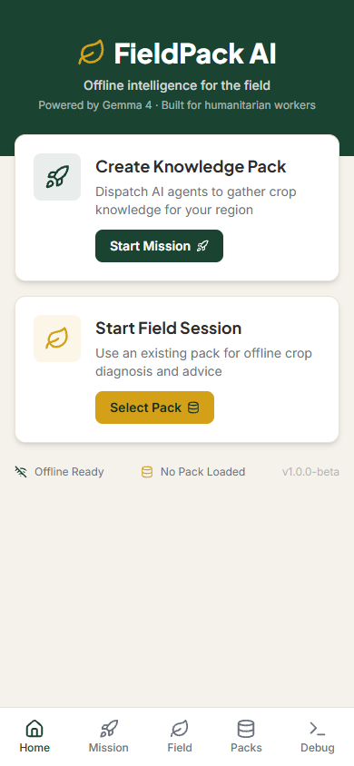
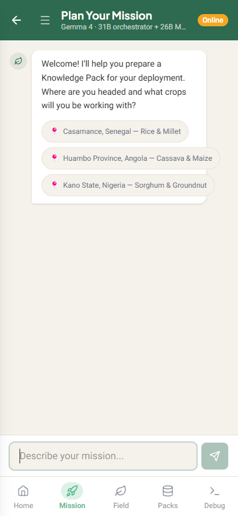
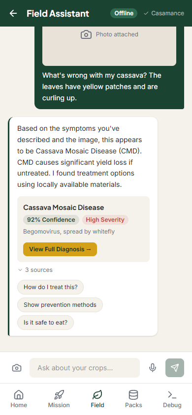
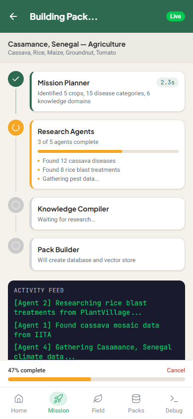
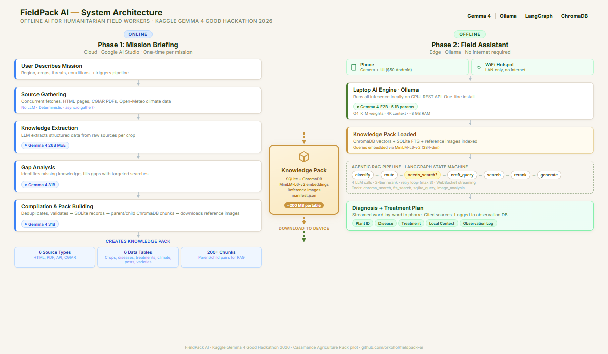
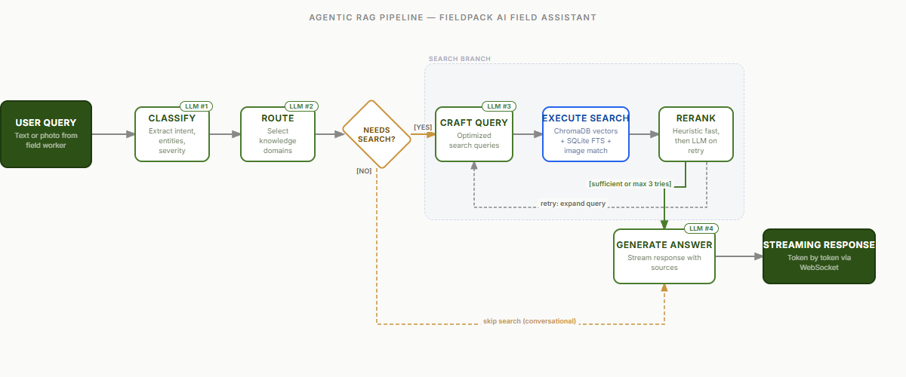

<p align="center">
  <h1 align="center">FieldPack AI</h1>
  <p align="center">
    <strong>Offline expert knowledge for humanitarian field workers</strong>
  </p>
  <p align="center">
    Gemma 4 cloud agents curate mission-specific Knowledge Packs.<br>
    An edge model serves them without internet.
  </p>
  <p align="center">
    <a href="https://www.kaggle.com/competitions/gemma-4-good-hackathon"></a>
    <a href="https://ai.google.dev/gemma"></a>
    <a href="https://ollama.com"></a>
    <a href="LICENSE"></a>
  </p>
</p>

---

> *"The people who need AI most are the ones furthest from the cloud."*

**FieldPack AI** is an offline-first AI system for humanitarian field workers. Powerful cloud models (Gemma 4 31B/26B) curate domain-specific knowledge before deployment. A lightweight edge model (Gemma 4 E2B, 5.1B params via Ollama) serves that knowledge in the field — no internet required.

**Demo video:** [https://youtu.be/y9FSAkYpFII](https://youtu.be/y9FSAkYpFII) (3 min)

<p align="center">
  
  &nbsp;
  
  &nbsp;
  
  &nbsp;
  
</p>

## For Judges — 60-Second Setup

One command. Real Ollama, real Gemma 4 E2B, real agentic RAG pipeline. No Python, no Node, no manual dependency install.

```bash
git clone https://github.com/orkohol/fieldpack-ai.git
cd fieldpack-ai
docker-compose up
# Open http://localhost:5173
```

**What to try** (matches the [demo video](https://youtu.be/y9FSAkYpFII)):

1. **Hero shot** — open the app → **Field Chat** → upload a cassava leaf photo (or use the built-in sample) → watch a grounded, source-cited diagnosis stream in, fully offline.
2. **Agentic RAG** — ask a follow-up question. Observe classification, retrieval, rerank, and generation stages in the pipeline panel.
3. **Knowledge Pack** — browse the Casamance Agriculture pack (5 crops, 15 diseases, verified sources).

**First run:** `ollama-init` pulls Gemma 4 E2B (~5 GB, ~5 min) — subsequent runs start in seconds. **Requirements:** Docker Desktop, ~8 GB RAM, ~10 GB disk. Full Docker details, GPU passthrough, and troubleshooting: see [Run in Docker](#run-the-real-app-in-docker-for-reviewers) below.

---

## Run on Your Phone (the Real Demo)

This is how FieldPack is designed to be used: the **laptop is the AI server**, the **phone is a thin client** connecting over local WiFi. Exactly what Amina does in the field — no internet.

### Step 1 — Laptop: start the backend

```bash
docker-compose up
```

Same as the 60-second setup above. Leave it running.

### Step 2 — Phone: download the APK

**APK download:** [fieldpack-ai-v1.0.0-debug.apk](TODO_APK_URL) *(9.7 MB — debug build)*

**SHA256 checksum (verify integrity):**
```
831984eb9fa29bd585ddef60c409e87bdce01e4a24d038f26f68932ec6f525df
```

**Virus scan:** [VirusTotal report](TODO_VIRUSTOTAL_URL) — 0 detections

> This is a **debug-signed APK**. Android will warn "Unknown developer" — expected for hackathon submissions. The SHA256 and VirusTotal link are there so you can verify integrity before installing. Requires Android 12+ (Chrome WebView 111+).

Install on phone:
1. Download the APK to the phone
2. Open it from Downloads → Android prompts "Install unknown apps" → allow for your browser → Install
3. Launch **FieldPack AI**

### Step 3 — Network: put phone and laptop on the same WiFi

Three options, pick whichever is easiest:

| Scenario | How |
|---|---|
| **Home/office WiFi** | Both phone and laptop connect to the same WiFi network |
| **Laptop as hotspot** (closest to the demo video) | Windows: **Settings → Network → Mobile hotspot → On**. macOS: **System Settings → General → Sharing → Internet Sharing**. Then connect the phone to the laptop's hotspot SSID. |
| **Phone as hotspot** | Turn on phone's mobile hotspot, connect the laptop to it |

**Important:** your laptop's firewall must allow inbound traffic on port 8000. Windows Defender typically prompts on first run — choose "Allow access." If the phone can't connect, this is usually why.

### Step 4 — Phone: connect to the laptop backend

The app **auto-scans** on launch. If it finds the backend, you'll see the home screen with "Connected." If not:

1. Find the laptop's IP address:
   - **Windows:** open PowerShell → `ipconfig` → look for `IPv4 Address` under your active adapter (e.g. `192.168.1.42`)
   - **macOS/Linux:** terminal → `ifconfig | grep "inet "` → find the `192.168.x.x` or `10.x.x.x` address
   - **Windows hotspot:** the laptop is usually `192.168.137.1`
2. In the app, tap the **gear icon** (top right of home screen) → enter `http://<laptop-ip>:8000` → **Test Connection** → **Save & Connect**

### Step 5 — Try the hero shot

Open **Field Chat** on the phone → tap the camera icon → take a photo of a cassava leaf (or any plant) → watch the diagnosis stream in, live, over your local network — the phone has no internet, and neither does the laptop during inference.

**If it doesn't work:**
- Phone says "Cannot reach server" → firewall blocking port 8000 on the laptop
- App loads but WebSocket fails → Capacitor `cleartext` permission (already enabled in the shipped APK) or an HTTPS-only WiFi captive portal blocking LAN traffic
- All endpoints timeout → phone and laptop aren't actually on the same subnet — double-check with `ping <laptop-ip>` from a terminal app on the phone

---

## The Problem

3.7 billion people lack reliable internet. Among them are the humanitarian workers, farmers, and health workers who hold communities together. They need expert-level knowledge to do their jobs, but AI requires the cloud, and the cloud requires internet.

Offline AI exists — but a general model without domain knowledge is like a doctor with a degree but no information about the disease in front of them. **The value of offline AI is not the model. It is the knowledge the model carries.**

## How It Works

### Two Phases, One System



### The Agentic RAG Pipeline

The Field Assistant doesn't follow a fixed retrieval chain. It's a LangGraph state machine that decides at each step whether it has enough context to answer:



## Quick Start

### Demo Mode (no GPU/Ollama required)

```bash
git clone https://github.com/orkohol/fieldpack-ai.git
cd fieldpack-ai

# Setup
python -m venv venv
source venv/bin/activate            # macOS/Linux
# source venv/Scripts/activate      # Windows (Git Bash)
pip install -r backend/requirements.txt
cd frontend && npm install && cd ..

# Configure
cp backend/.env.example backend/.env  # DEMO_MODE=true by default

# Start backend (from repo root)
cd backend && PYTHONPATH=. uvicorn app.main:app --reload --host 0.0.0.0 --port 8000 &
cd ..

# Start frontend (from repo root)
cd frontend && npm run dev
# Open http://localhost:5173
```

### Full Mode (Ollama + Gemma 4 E2B)

```bash
# Install Ollama: https://ollama.com/download
ollama pull gemma4:e2b-it-q4_K_M
ollama serve

# Set in backend/.env:
#   DEMO_MODE=false
#   FIELD_LLM_PROVIDER=ollama-local
#   OLLAMA_BASE_URL=http://localhost:11434

# Start backend (from repo root)
cd backend && PYTHONPATH=. uvicorn app.main:app --reload --host 0.0.0.0 --port 8000 &
cd ..

# Start frontend (from repo root)
cd frontend && npm run dev
```

See [`backend/.env.example`](backend/.env.example) for all configuration options.

### Run the real app in Docker (for reviewers)

One command, real Ollama, real Gemma 4 E2B, real RAG — no manual setup.

```bash
git clone https://github.com/orkohol/fieldpack-ai.git
cd fieldpack-ai
docker-compose up
# Open http://localhost:5173
```

**First run:** the `ollama-init` container pulls Gemma 4 E2B (~5 GB, ~5 min). The `app` container waits for the model to be ready before serving requests, so the first page load may take a few minutes. Subsequent runs start in seconds — the model persists in a Docker volume.

**Requirements:** Docker Desktop (or Docker Engine + Compose), ~8 GB RAM available to the containers, ~10 GB free disk.

**Do not copy `backend/.env.example` to `.env`** when running in Docker. Compose provides all required environment variables directly (with `DEMO_MODE=false`). Copying the example file is only for native (non-Docker) runs.

**GPU acceleration:** Off by default (works on any machine, CPU-only). If you have an Nvidia GPU with `nvidia-container-toolkit` installed, uncomment the `deploy:` block in `docker-compose.yml` for passthrough — answers come back noticeably faster (typically several × speedup on discrete GPUs).

**Troubleshooting — garbled / nonsense output:** Likely means Ollama is partially offloading to an Intel integrated GPU, which splits Gemma E2B layers across precision boundaries. Fix: uncomment `OLLAMA_NUM_GPU=0` in `docker-compose.yml` and run `docker-compose restart ollama`. Answers come back correct (CPU-only, slower).

**Troubleshooting — model pull fails:** If the `ollama-init` container exits with "pull model manifest: file does not exist", the Gemma 4 E2B tag in the public Ollama registry has changed. Run `curl https://ollama.com/library/gemma4/tags` or check the library page to find the current tag, then update `OLLAMA_MODEL` in `docker-compose.yml` and the pull command inside `ollama-init`.

## Tech Stack

| Component | Technology | Purpose |
|-----------|-----------|---------|
| Backend | FastAPI | Async API server, WebSocket streaming |
| Agent Orchestration | LangGraph | State machine for agentic RAG pipeline |
| Vector Store | ChromaDB (persistent) | Semantic search over Knowledge Pack |
| Embeddings | sentence-transformers (MiniLM-L6-v2) | Offline-capable embedding model |
| Structured DB | SQLite | Portable knowledge storage |
| Edge LLM | Gemma 4 E2B Q4_K_M via Ollama | 5.1B params, ~8 GB RAM, runs on CPU |
| Cloud LLMs | Gemma 4 31B + 26B via AI Studio | Knowledge curation agents |
| Frontend | React 19 + Tailwind v4 + TypeScript | Responsive field-ready UI |
| Mobile | Capacitor 8 | Android APK (thin client) |

## Project Structure

```
fieldpack-ai/
├── backend/
│   ├── app/
│   │   ├── agents/              # Field Assistant (offline RAG)
│   │   │   ├── nodes/           # Pipeline nodes: classify, route, rerank, generate
│   │   │   ├── field_assistant.py
│   │   │   └── state.py         # LangGraph state definition
│   │   ├── agent_farm/          # Cloud agents (online knowledge curation)
│   │   │   ├── phases/          # Source gathering, knowledge extraction
│   │   │   ├── sources/         # PDF, HTML, climate, CGIAR parsers
│   │   │   └── tools/           # Web search, web fetch
│   │   ├── knowledge_pack/      # Pack builder, schema, seed data
│   │   ├── models/              # LLM providers (Ollama, Google AI Studio)
│   │   ├── routers/             # API endpoints
│   │   ├── tools/               # RAG tools: ChromaDB search, SQLite, images
│   │   └── main.py              # FastAPI app entry point
│   ├── tests/                   # 581 tests, 10,765 lines
│   └── .env.example
├── frontend/
│   ├── src/
│   │   ├── pages/               # Chat, diagnosis, observations, settings
│   │   ├── components/          # Reusable UI components
│   │   ├── hooks/               # Server connection, swipe, Android back
│   │   └── lib/                 # API client, config, offline queue
│   └── android/                 # Capacitor Android project
├── packs/
│   └── casamance_agriculture/   # Demo Knowledge Pack
│       ├── knowledge.db         # SQLite structured data
│       ├── chroma_db/           # Vector embeddings
│       ├── images/              # Reference crop photos
│       └── SOURCES.md           # Data provenance
├── notebooks/
│   └── colab_ollama_gpu.ipynb   # Colab GPU tunnel for remote Ollama
├── docs/
│   ├── images/                  # Architecture diagrams, cover image
│   ├── PHILOSOPHY.md            # Project strategy & competition analysis
│   ├── TECH_FRAMEWORK.md        # Full architecture documentation
│   ├── VIDEO_SCRIPT.md          # 3-minute video production bible
│   └── KAGGLE_WRITEUP.md        # Competition writeup
└── video-frames/                # React app for video frame generation
```

## Knowledge Packs

A Knowledge Pack is a portable, self-contained knowledge base built for a specific mission:

| Contents | Format | Purpose |
|----------|--------|---------|
| Structured data | SQLite | Diseases, treatments, crops, climate |
| Semantic vectors | ChromaDB | Natural language search over 200+ chunks |
| Reference images | JPEG | Crop disease identification |
| Manifest | JSON | Pack metadata, version, provenance |

The demo ships with the **Casamance Agriculture Pack** — covering cassava diseases, treatment protocols, drought-resistant farming, and regional climate data for southern Senegal. See [`packs/casamance_agriculture/SOURCES.md`](packs/casamance_agriculture/SOURCES.md) for full data provenance.

The architecture is domain-agnostic: the same system supports disaster medical triage, rural literacy education, wildlife conservation, or any domain where expert knowledge needs to travel offline.


## Competition

This project is an entry in the [Kaggle Gemma 4 Good Hackathon](https://www.kaggle.com/competitions/gemma-4-good-hackathon) ($200K prize pool, deadline May 18, 2026).

## License

FieldPack AI source code is released under the [MIT License](LICENSE).

### Third-party licenses

This project uses **Gemma** models provided by Google. Gemma is subject to the
[Gemma Terms of Use](https://ai.google.dev/gemma/terms) and the
[Gemma Prohibited Use Policy](https://ai.google.dev/gemma/prohibited_use_policy).
Any use, reproduction, or distribution of this project — or derivative works
that incorporate Gemma or its outputs — must comply with those terms in
addition to the MIT License covering FieldPack AI's own source code.

See [`NOTICE`](NOTICE) for the full attribution and pass-through notice.
